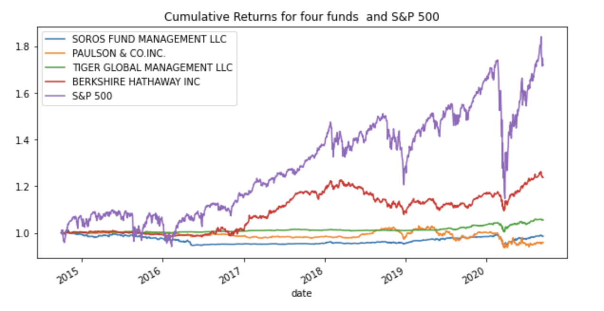
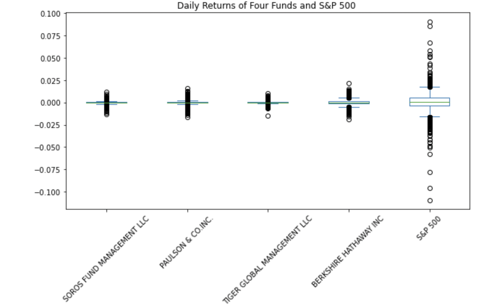
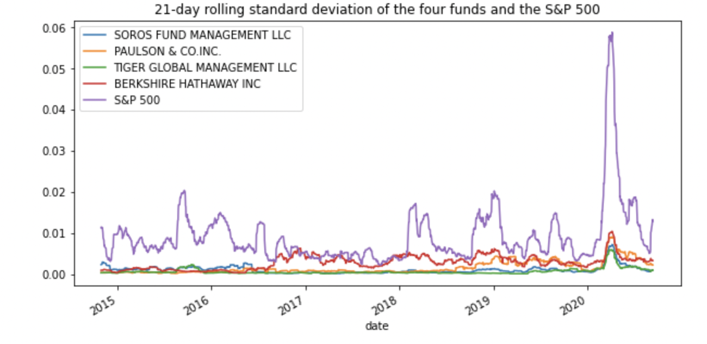

## risk_return_analysis

The **risk_return_analysis** determins the fund with the most investment potential based on key risk-management metrics: the daily returns, standard deviations, Sharpe ratios, and betas.


## Technologies

This project leverages python 3.7.13 with the following packages:

* [pandas](https://pandas.pydata.org/) - For data analysis


---

## Installation Guide

Before running the application first install the pandas dependency in conda dev environment.

```python

    conda create -n dev python=3.7 anaconda

    python -m ipykernel install --user --name dev

    conda activate dev

    conda install pandas

    conda deactivate 
  
```

---


## Usage

To use the **risk_return_analysis** simply clone the repository and run the **risk_return_analysis.ipynb** with jupyter lab:

```python
    conda activate dev

    jupyter lab

    conda deactivate 
```

Plots of Cumulative Returns, Daily Returns and 21-Day Rolling Standard Deviation.









---

## Contributors

Kausar Hina

---

## License

MIT
